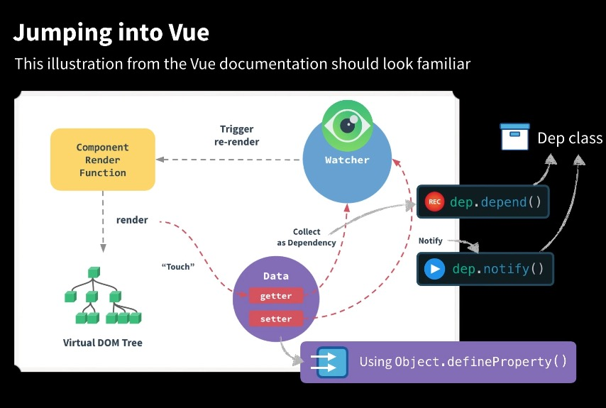

:::  tip
Vue2.0响应式伪代码   
:::
在实现响应式的过程中使用观察者模式（发布订阅模式）:
```javascript
    class Dep {
        constructor() {
            this.subscribers = []
        }
        depend() {
            if (target && !this.subscribers.includes(target)){
                this.subscribers.push(target)
            }
        }
        notify() {
            this.subscribers.forEach((sub) => {
                sub()
            })
        }
    }

    const dep = new Dep()
    let price = 5
    let quantity = 2
    let total = 0
    let target  = null

    function wactcher(myFunc) {
        target = myFunc;
        dep.depend()
        target()
        target = null
    }

    watcher(() => {
        total = price * quantity
    })


```
 > We need a way to indetify which priperties are accessed <br>
 >inside each watcher,to figure out which Dep instance to call <br>
 >if we can identify when a property is updated(or det),we <br>
 >can trigger a dep.notify() to be called on its Dep class<br>

 我们需要一种方式来识别访问的是哪个属性并调用对应的dep里的方法执行，<br>
 当一个属性更新的时候我们能够识别并能触发对应Dep类中的notify方法
``` js
 let data = { price: 5, quantity: 2 }
 Object.keys(data).forEach(() => {
     let interalValue = data[key]
     Object.defineProperty(data, key, {

         get() {
            console.log(`Getting ${ket}: ${internalValue}`)
            return internalValue
         },

         set(newVal) {
             console.log(`Setting ${key} to :${newVal}`)
             internalValue = newVal

         }
     })
 })
 total = data.price * data.quantity
 data.price = 20
  
```
:::  tip
 现在我们需要将上面两段代码结合起来完成我们简单的响应式
:::

```js
let data = { price: 5, quantity: 2 }
let target, total, salePrice
class Dep {
    constructor() {
        this.subscribers = []
    }
    depend() {
        if (target && !this.subscribers.includes(target)){
            this.subscribers.push(target)
        }
    }
    notify() {
        this.subscribers.forEach((sub) => {
            sub()
        })
    }
}
Object.keys(data).forEach(() => {
     let interalValue = data[key]

     const dep = new Dep()

     Object.defineProperty(data, key, {
         get() {
            dep.depend() // remember the target wer're running
            return internalValue
         },
         set(newVal) {
             internalValue = newVal
             dep.notify() // Rerun saved targets
         }
     })
 })

function wactcher(myFunc) {
    target = myFunc;
    dep.depend()
    target()
    target = null
}

watcher(() => {
    total = price * quantity
})

```
